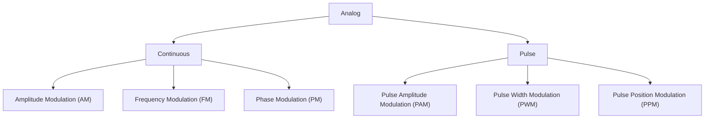

## MODULATION
Modulation is the process in which certain parameters of a high-frequency carrier signal (such as amplitude, frequency, or phase) are varied in accordance with the instantaneous value of the modulating signal. This modulated signal is then transmitted by the transmitter. At the receiver end, the signal is demodulated to retrieve the original information. Thus, demodulation is the reverse process of modulation.

In the process of modulation, the carrier wave acts as a medium that carries the information signal (modulating signal) from the transmitter to the receiver.



### **Types of Modulation:**

1. **Analog Modulation** – Used in traditional radio and TV broadcasting.
    
    - **Amplitude Modulation (AM)**: Varies the amplitude of the carrier signal.
    - **Frequency Modulation (FM)**: Varies the frequency of the carrier signal.
    - **Phase Modulation (PM)**: Varies the phase of the carrier signal.
2. **Digital Modulation** – Used in modern communication systems like Wi-Fi, mobile networks, and satellite communication.
    
    - **Amplitude Shift Keying (ASK)**: Represents data using changes in amplitude.
    - **Frequency Shift Keying (FSK)**: Represents data using changes in frequency.
    - **Phase Shift Keying (PSK)**: Represents data using changes in phase.
    - **Quadrature Amplitude Modulation (QAM)**: Combines both amplitude and phase variations.

# **Mathematical Representation of Modulation**

---

## **1. Amplitude Modulation (AM)**

In **AM**, the amplitude of the carrier signal is varied according to the instantaneous value of the message signal.

$$ s(t) = \left[ A_c + A_m \cos(2\pi f_m t) \right] \cos(2\pi f_c t) $$

where:  
- \( s(t) \) = Modulated signal  
- \( A_c \) = Carrier amplitude  
- \( A_m \) = Message amplitude  
- \( f_c \) = Carrier frequency  
- \( f_m \) = Modulating frequency  

### **Modulation Index (\(\mu\))**
$$
\mu = \frac{A_m}{A_c}
$$

- If \( \mu < 1 \) → **Under-Modulation**  
- If \( \mu = 1 \) → **100% Modulation**  
- If \( \mu > 1 \) → **Over-Modulation (causes distortion)**  

### **Bandwidth of AM**
$$
BW = 2 f_m
$$

---

## **2. Frequency Modulation (FM)**

In **FM**, the frequency of the carrier wave is varied in proportion to the message signal.

$$
s(t) = A_c \cos \left( 2\pi f_c t + \beta \sin(2\pi f_m t) \right)
$$

where:  
- \( \beta = \frac{\Delta f}{f_m} \) (Modulation Index)  
- \( \Delta f \) = Maximum frequency deviation  

### **Bandwidth of FM (Carson’s Rule)**
$$
BW = 2 (\Delta f + f_m)
$$

---

## **3. Phase Modulation (PM)**

In **PM**, the phase of the carrier signal is varied in proportion to the message signal.

$$
s(t) = A_c \cos \left( 2\pi f_c t + k_p m(t) \right)
$$

where:  
- \( k_p \) = Phase sensitivity constant  
- \( m(t) \) = Message signal  

---

## **4. Pulse Amplitude Modulation (PAM)**

In **PAM**, the amplitude of **discrete pulses** is varied according to the message signal.

$$
s(t) = A_m \cdot m(t) \cdot p(t)
$$

where:  
- \( p(t) \) = Pulse train  
- \( m(t) \) = Message signal  

---

## **5. Pulse Width Modulation (PWM)**

In **PWM**, the width (duration) of pulses is varied according to the message signal.

$$
T_w = T \times D
$$

where:  
- \( T_w \) = Pulse width  
- \( T \) = Total time period  
- \( D \) = Duty cycle  

### **Duty Cycle Formula**
$$
D (\%) = \left(\frac{T_{\text{on}}}{T}\right) \times 100
$$

---

## **6. Pulse Position Modulation (PPM)**

In **PPM**, the position of each pulse is varied according to the message signal.

$$
\Delta t = k_m m(t)
$$

where:  
- \( k_m \) = Modulation sensitivity  
- \( m(t) \) = Message signal  

---

# **DSB-SC (Double Sideband Suppressed Carrier) Modulation**  

## **Definition:**  
**DSB-SC (Double Sideband Suppressed Carrier)** is a type of **Amplitude Modulation (AM)** in which the carrier signal is **suppressed**, and only the **sidebands** are transmitted. This improves efficiency as no power is wasted in transmitting the carrier.

---

## **Mathematical Representation of DSB-SC**  
The modulated signal in **DSB-SC** is given by:

$$
s(t) = A_m \cos(2\pi f_m t) \cdot A_c \cos(2\pi f_c t)
$$

Using the **product-to-sum identity**:

$$
\cos A \cos B = \frac{1}{2} [\cos(A - B) + \cos(A + B)]
$$

we get:

$$
s(t) = \frac{A_m A_c}{2} [\cos(2\pi (f_c - f_m)t) + \cos(2\pi (f_c + f_m)t)]
$$

where:  
- \( A_c \) = Carrier amplitude  
- \( A_m \) = Message signal amplitude  
- \( f_c \) = Carrier frequency  
- \( f_m \) = Modulating frequency  

---

## **Key Characteristics of DSB-SC:**  
✅ **Carrier Suppressed**: No power is wasted in transmitting the carrier signal.  
✅ **Efficient Power Usage**: Only sidebands carry information.  
✅ **Bandwidth**: Same as standard AM, **\( BW = 2 f_m \)**.  
✅ **Demodulation Requires Coherent Detection**: Since the carrier is suppressed, **synchronous demodulation** is required to recover the message signal.  

---

## **Comparison: AM vs. DSB-SC**
| Feature           | AM (Standard) | DSB-SC |
|------------------|-------------|--------|
| Carrier Present? | ✅ Yes | ❌ No |
| Power Efficiency | ❌ Low | ✅ High |
| Bandwidth        | \( 2f_m \) | \( 2f_m \) |
| Demodulation     | Envelope Detector | Coherent Detection |

---

## **Applications of DSB-SC**  
📡 **Radio Communication**  
📺 **TV Broadcasting** (Used in vestigial sideband, a variation of DSB)  
🔊 **Speech and Music Transmission**  
📶 **Software-Defined Radio (SDR) and Digital Communications**  

---

